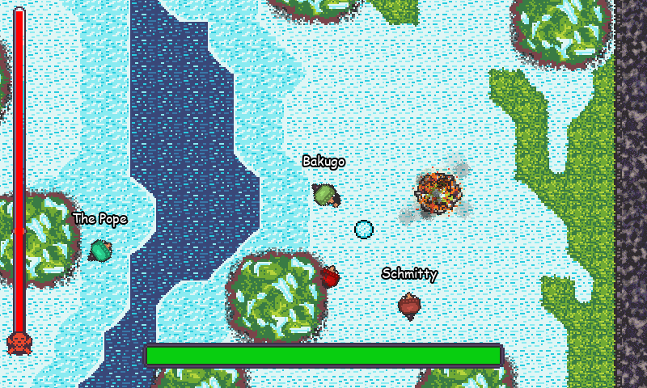
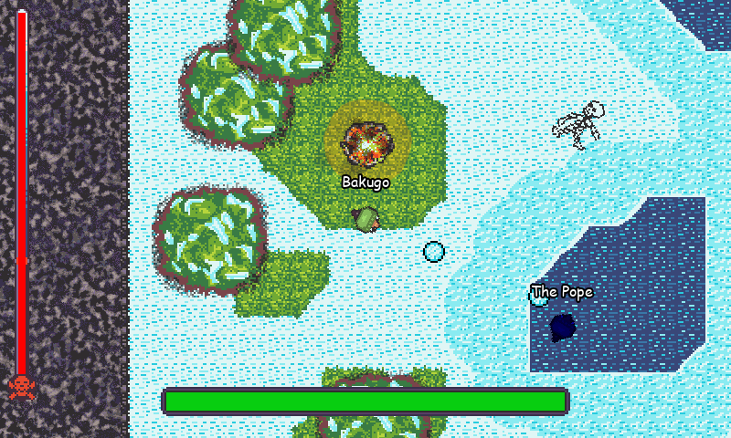

# Frozen Feebs - Entry for the OU GDA 2021 Winter Game Jam

Frozen Feebs is a multiplayer snowball deathmatch game. The aim is to throw snowballs at other players to decrease their temperature, and once their temperature is low enough, they will start dying. You can also freeze people by knocking them into bodies of cold water, but they can also get warm again by finding a bonfire, and they can hide inside of trees to ambush you. The last person standing is declared the winner.

 

This was made in the span of about 3 weeks and is my first networked multiplayer game.
It features music by another member of the club as well as voice acting from a friend, nicknamed "Feeb."
In fact, the voice lines are literally recorded from her playing the game Ghostrunner and getting angry at it!

The source code is licensed under GPL3 (see LICENSE.txt) and the assets are licensed under [CC BY-NC 4.0](https://creativecommons.org/licenses/by-nc/4.0/) (The music, specificially, is licensed to Juliette Lee and can be found on [her Soundcloud page](https://soundcloud.com/user-802311135-865259561/chucking-snowballs)).

Please direct any questions to tophatdemonproductions@gmail.com.
